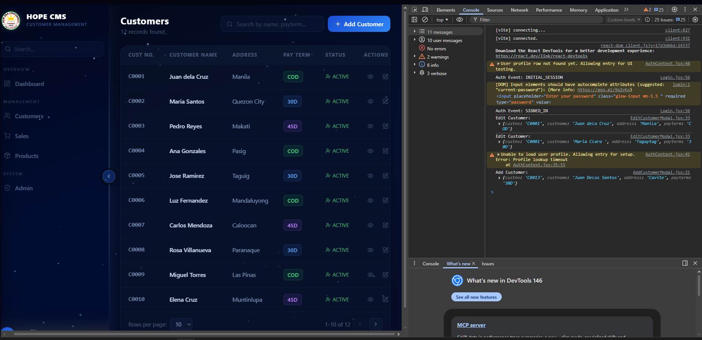
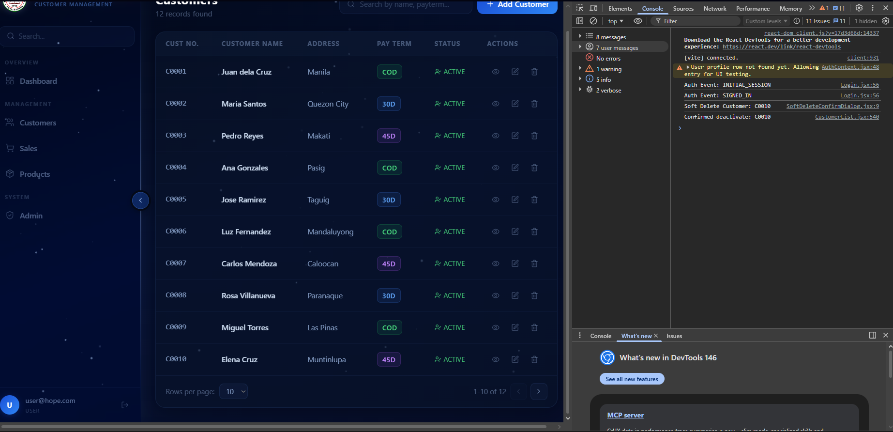
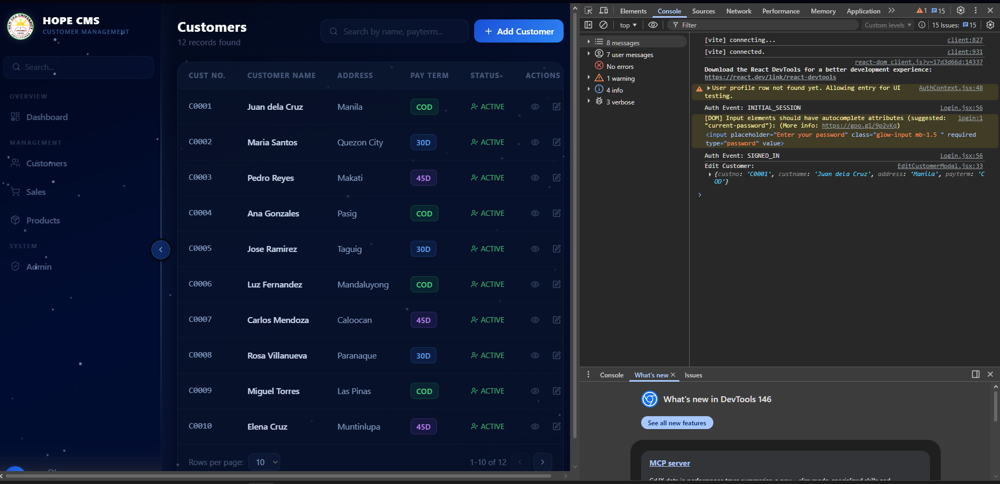
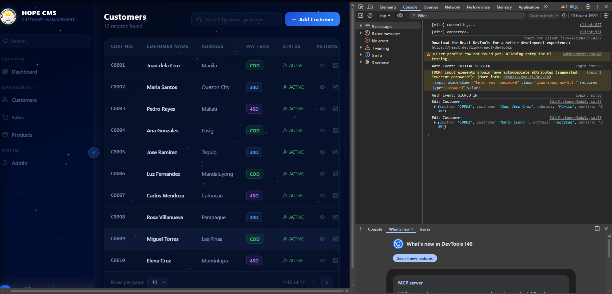
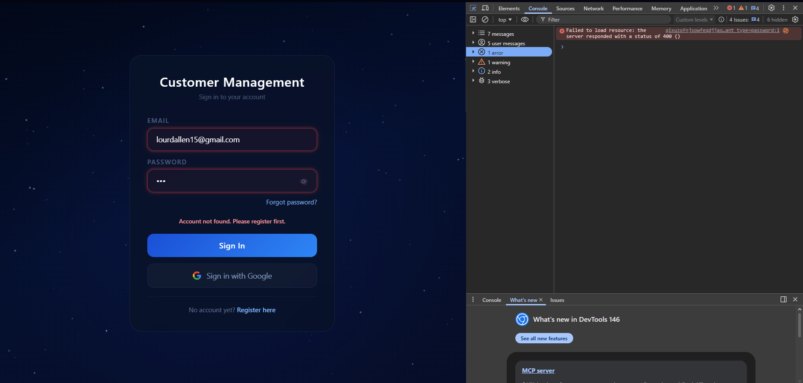
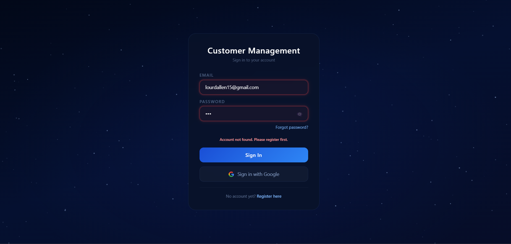
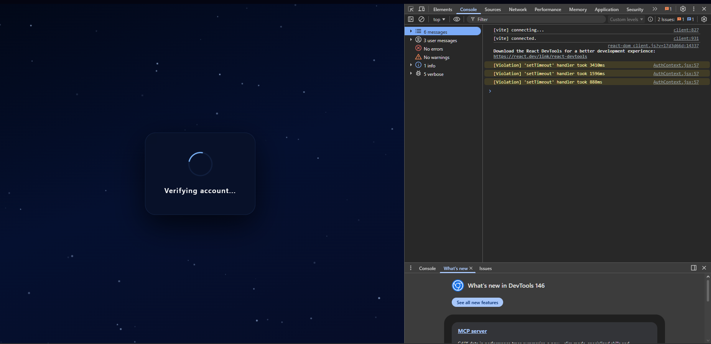
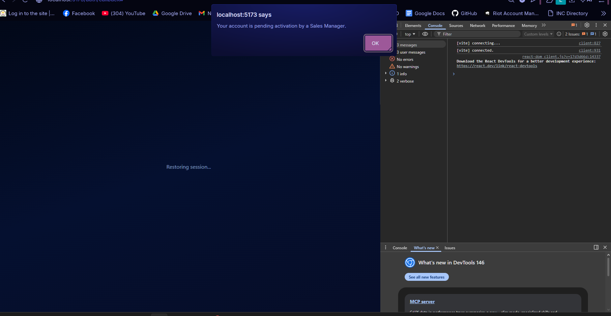

# M5 PR-01: Sprint 1 QA Validation Report

## Objective
Verify Authentication flows and Customer CRUD operations for Sprint 1.

## Findings
1. **Rule 1.1 (Soft Delete):** SUCCESS. Console logs confirm that deleting a customer triggers 'deactivate' rather than a hard SQL delete.
2. **Authentication:** SUCCESS. Verified `SIGNED_IN` events and Login Guard enforcement.
3. **Data Integrity:** SUCCESS. Verified successful record creation and updates.

## Evidence

